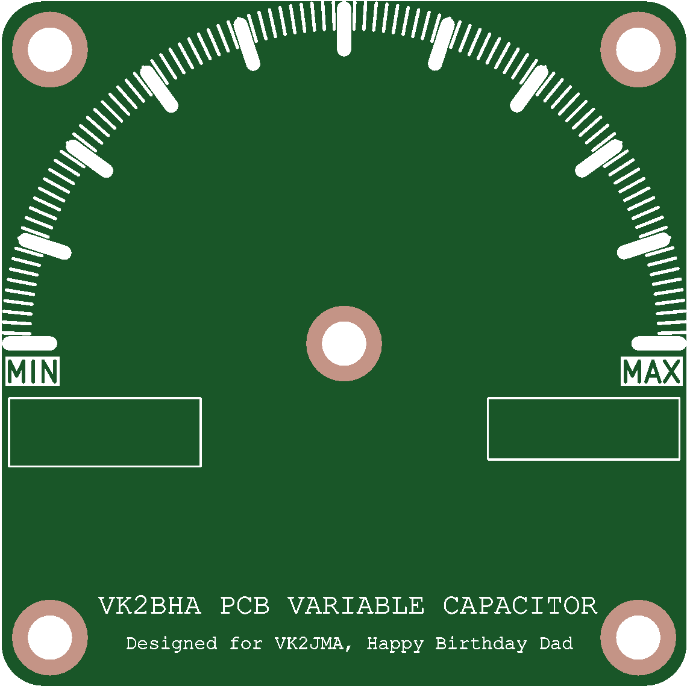
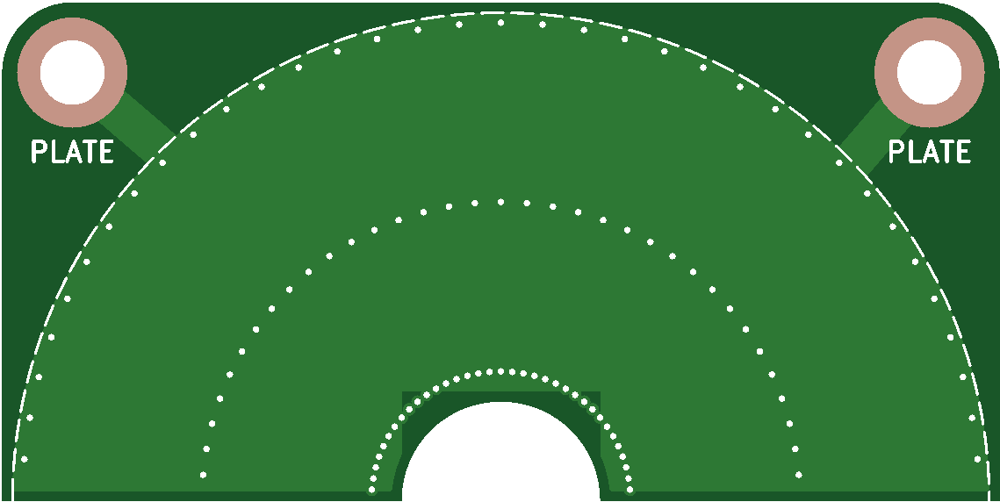
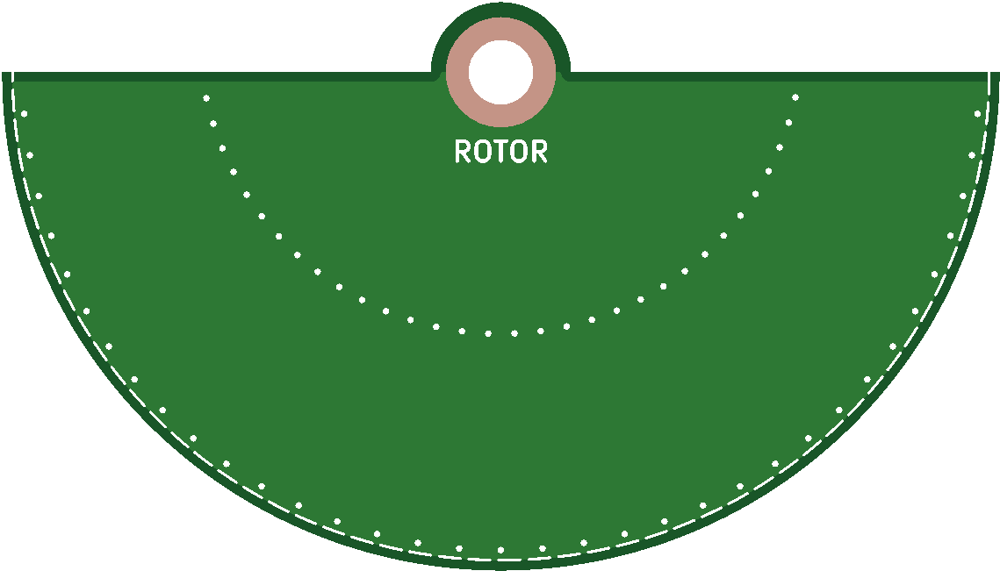

# pcb-variable-capacitor
An Variable Capacitor Kit made of stacked PCB's

## Motivation

High voltage variable capacitors are required for tuning magnetic loop antennas. This kind of variable capacitor is often expensive and hard to find. This project aims to provide a low-cost alternative that can be easily built using PCB technology.

### Cost
#### PCB's 

In early april 2026, I ordered the PCB's for this project from JLCPCB, a popular PCB manufacturer. The total cost for the PCB's was around USD$70 for 10 capacitors (excluding shipping). 

## Design

Based on Air Variable Capacitor, the design consists of multiple PCB's stacked together to create a variable capacitor.
The PCB's are designed with interleaving fingers that can be rotated to change the capacitance. 

## General BOM
### PCB's

- 2 `front_rear_panel` PCB's 
- 1 or more `rotor` PCB's (see theoretical capacitance table below)
- 1 or more `plate` PCB's (see theoretical capacitance table below)
- 1 `spacer` PCB per plate PCB
- 2 `spacer` PCB's per rotor PCB

### Other Components

- 2 M3 spring washers
- 4 M3 x 40mm screws (for 5 rotor and 6 plate, 1mm spaced configuration, adjust accordingly for different configurations)
- 1 M3 threaded rod 
- 10 M3 nuts
- 2 M3 flat, or lock washers per spacer PCB

### Assembly Tools

- spanner or socket to fit your M3 screws and nuts
- solder paste and hot air gun (Optional)

## Construction
### Rotor Assembly

Use the theoretical capacitance table to determine the number of rotor and plate PCB's needed for your desired capacitance range. For example, if you want a maximum capacitance of around 50 pF, you can use 2 rotor PCB's and 3 plate PCB's.

## Theoretical Capacitance

The following table shows the theoretical capacitance values for different configurations of rotors and plates, both without additional spacers and with 1.0 mm additional spacers.

| Rotors | Plates | Max C, No Additional Spacers | Max C @ 1.0 mm additional spacers |
| -----: | -----: | ------------------: | -----------------: |
|      1 |      2 |           48.93 pF |           15.73 pF |
|      2 |      3 |           97.87 pF |           31.46 pF |
|      3 |      4 |          146.80 pF |           47.19 pF |
|      4 |      5 |          195.74 pF |           62.92 pF |
|      5 |      6 |          244.67 pF |           78.65 pF |

## Images
### Front and Rear Plate

### Plate

### Rotor

### Spacers

